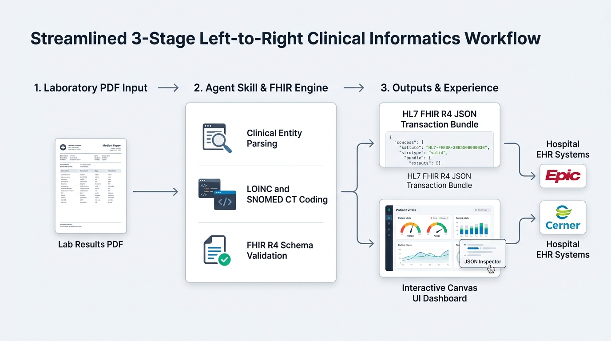

# Laboratory Report to HL7 FHIR Conversion Toolkit and Agent Skill

A clinical data conversion framework and Agent Skill that transforms unstructured and semi-structured laboratory report PDFs into standard HL7 FHIR Release 4 (R4) JSON resources (`Patient`, `Observation`, `DiagnosticReport`, `Specimen`, `Organization`, `Practitioner`, and transaction `Bundle`).

This toolkit is designed for healthcare interoperability workflows, facilitating the automated ingestion of specialized diagnostics—such as Multi-Cancer Early Detection (MCED) cell-free DNA methylation, liquid biopsy circulating tumor DNA (ctDNA), hereditary oncology Next-Generation Sequencing (NGS) panels, and biomarker immunoassays—into Electronic Health Record (EHR) systems like Epic, Oracle Cerner, and cloud FHIR repositories.

---

## Table of Contents

1. [Architecture and Clinical Scope](#architecture-and-clinical-scope)
2. [Project Directory Layout](#project-directory-layout)
3. [Non-Technical User Guide: How to Use This Skill](#non-technical-user-guide-how-to-use-this-skill)
   - [Overview for Non-Technical Users](#overview-for-non-technical-users)
   - [What Files You Can Upload](#what-files-you-can-upload)
   - [Sample Files Available for Testing](#sample-files-available-for-testing)
   - [Step-by-Step Walkthrough in an Agent Chat](#step-by-step-walkthrough-in-an-agent-chat)
   - [Exact Prompts to Use (What to Ask)](#exact-prompts-to-use-what-to-ask)
   - [Understanding the Results You Get Back](#understanding-the-results-you-get-back)
4. [Interactive Canvas UI & Visual Dashboard](#interactive-canvas-ui--visual-dashboard)
   - [Dual-Perspective Interface](#dual-perspective-interface)
   - [Click-to-Inspect FHIR Exploration](#click-to-inspect-fhir-exploration)
   - [Visual Biomarker Range Gauges](#visual-biomarker-range-gauges)
   - [How to Launch and Use the Visualizer](#how-to-launch-and-use-the-visualizer)
5. [Developer and Technical Guide](#developer-and-technical-guide)
   - [Installation and Dependencies](#installation-and-dependencies)
   - [Command Line Interface (CLI)](#command-line-interface-cli)
   - [Python API Usage](#python-api-usage)
   - [Generating Synthetic Test Data](#generating-synthetic-test-data)
   - [Validating FHIR Bundles](#validating-fhir-bundles)
   - [Automated Testing](#automated-testing)
6. [HL7 FHIR R4 Mapping Specification](#hl7-fhir-r4-mapping-specification)
7. [Clinical Ontology Standards (LOINC & SNOMED CT)](#clinical-ontology-standards-loinc--snomed-ct)
8. [Synthetic Data and Zero-PHI Compliance Statement](#synthetic-data-and-zero-phi-compliance-statement)
9. [License](#license)

---

## Synthetic Data Notice

All sample laboratory reports, PDF files in the `reports/` directory, test fixtures, and output FHIR JSON bundles provided in this project are 100% synthetic. They contain zero real patient Protected Health Information (PHI) and zero Personally Identifiable Information (PII). All patient names, medical record numbers (MRNs), dates of birth, physician identities, National Provider Identifiers (NPIs), laboratory names, CLIA certificate IDs, and diagnostic measurements are fictitious, simulated values created solely for software testing and validation.

---

## Architecture and Clinical Scope

Diagnostic laboratory results are frequently delivered to care teams as unstructured or formatted PDF documents. Integrating these records into modern clinical informatics systems requires converting document-level text and tabular findings into discrete, coded resources.

This project provides:
- **Heuristic Layout and PDF Extraction Engine**: Extracts text, page geometries, and tabular bounding boxes using `pdfplumber` and `pypdf`, decoding private font encodings and Unicode ligatures.
- **Clinical Entity and Biomarker Parser**: Parses patient demographics, ordering providers, CLIA-certified testing laboratories, specimen chain of custody, quantitative measurements, qualitative variant classifications, and clinical narratives.
- **HL7 FHIR R4 Constructor**: Assembles standard FHIR resources and transaction bundles with full cross-resource referential integrity (`urn:uuid:` references).
- **Referential and Schema Validator**: Verifies resource constraints, required elements, and internal reference targets.
- **Interactive Canvas UI Visualizer**: A rich, dual-perspective clinical dashboard and interactive FHIR inspector designed for native iframe rendering in agent harnesses (Gemini Enterprise App, Antigravity, Spark).
- **Multi-Platform Agent Skill (`SKILL.md`)**: Enables conversational AI assistants to autonomously parse, validate, convert, and visualize lab reports.



```text
+-----------------------+     +--------------------------+     +--------------------------+
|  Laboratory PDF /     | --> |  Extraction & Parsing    | --> |  HL7 FHIR R4 Bundle      |
|  Unstructured Text    |     |  - Key-Value Extraction  |     |  - Patient               |
+-----------------------+     |  - LOINC / SNOMED CT     |     |  - DiagnosticReport      |
                              +--------------------------+     |  - Observations          |
                                           |                   |  - Specimen              |
                                           v                   |  - Practitioner / Org    |
                              +--------------------------+     +--------------------------+
                              |  Canvas UI Dashboard     |                  |
                              |  - Clinical View & Gauges|                  v
                              |  - Click-to-Inspect FHIR |     +--------------------------+
                              +--------------------------+     |  EHR / FHIR Server       |
                                                               |  (Epic, Cerner, GCP)     |
                                                               +--------------------------+
```

---

## Project Directory Layout

```text
.
├── LICENSE                                    # Apache 2.0 open-source license
├── README.md                                  # Comprehensive documentation
├── SKILL.md                                   # Root Agent Skill entrypoint
├── requirements.txt                           # Python dependencies
├── assets/                                    # Documentation diagrams and UI assets
│   └── workflow_overview.png                  # Clinical workflow architecture diagram
├── ui/                                        # Canvas UI single-file web application
│   └── fhir_viewer.html                       # Interactive clinical dashboard & FHIR inspector
├── reports/                                   # Synthetic early cancer detection PDF reports
│   ├── synthetic_cancer_lab_report.pdf        # Multi-Cancer Early Detection (Positive / Lung & Pancreas)
│   ├── synthetic_mced_negative.pdf            # Multi-Cancer Early Detection (Negative Baseline)
│   ├── synthetic_colorectal_ctdna.pdf         # Colorectal ctDNA Liquid Biopsy Panel (SEPT9 / KRAS / TP53)
│   ├── synthetic_hereditary_ngs_panel.pdf     # 15-Gene Hereditary Oncology NGS Panel (BRCA1 Pathogenic)
│   └── synthetic_prostate_phi_panel.pdf       # Prostate Health Index (phi) Biomarker Panel
├── output/                                    # Generated FHIR R4 JSON bundles
│   ├── synthetic_cancer_lab_report_fhir.json
│   ├── synthetic_mced_negative_fhir.json
│   ├── synthetic_colorectal_ctdna_fhir.json
│   ├── synthetic_hereditary_ngs_panel_fhir.json
│   └── synthetic_prostate_phi_panel_fhir.json
├── src/                                       # Core Python processing library
│   ├── __init__.py
│   ├── cli.py                                 # CLI interface
│   ├── extractor.py                           # PDF text, table, and layout extraction
│   ├── parser.py                              # Clinical entity and tabular parser
│   ├── fhir_builder.py                        # HL7 FHIR R4 resource and bundle constructor
│   ├── fhir_validator.py                      # FHIR schema and referential validator
│   ├── visualizer.py                          # Canvas HTML dashboard generator
│   └── synthetic_generator.py                 # Clinical synthetic PDF report generator
├── scripts/                                   # Direct execution runner scripts
│   ├── convert.py                             # Conversion script
│   ├── validate.py                            # Bundle validation script
│   ├── visualize.py                           # Canvas UI launcher and HTML generator
│   └── generate_reports.py                    # Synthetic report generation script
├── skills/
│   └── lab-report-to-fhir/
│       ├── SKILL.md                           # Skill definition
│       ├── references/
│       │   ├── loinc_snomed_mapping.md        # LOINC & SNOMED CT reference tables
│       │   ├── fhir_r4_schemas.md             # FHIR R4 JSON schema models
│       │   └── ehr_integration_guide.md       # Epic & Cerner integration guide
│       ├── scripts/
│       │   ├── convert.py                     # Skill execution runner
│       │   └── visualize.py                   # Skill visualizer runner
│       └── ui/
│           └── fhir_viewer.html               # Packaged Canvas UI application
└── tests/                                     # Automated test suite (pytest)
    ├── __init__.py
    ├── test_extractor.py
    ├── test_parser.py
    ├── test_fhir_builder.py
    ├── test_fhir_validator.py
    ├── test_visualizer.py
    └── test_cli.py
```

---

## Non-Technical User Guide: How to Use This Skill

This section provides clear, non-technical instructions for clinical coordinators, health informatics analysts, compliance specialists, and general users who want to use this skill inside conversational AI agent interfaces (such as Gemini Enterprise App, Antigravity, ChatGPT Enterprise, or custom agent apps).

---

### Overview for Non-Technical Users

When laboratory test results arrive as PDF documents, hospital and clinic databases cannot automatically read the numbers or findings inside them. Electronic Health Record (EHR) systems—such as Epic or Cerner—require data in a standardized healthcare language called **HL7 FHIR**.

This skill allows you to simply upload a lab report PDF to the AI assistant and ask for a conversion. The AI agent will:
1. Read the text, tables, and sections of the PDF.
2. Extract the patient details, doctor information, specimen details, and test numbers.
3. Assign official medical coding terms (LOINC codes for lab tests and SNOMED CT codes for specimen types).
4. Generate a valid, standardized HL7 FHIR JSON file that can be loaded directly into an EHR system.

---

### What Files You Can Upload

You can upload any of the following file types into the chat window:
- **PDF Laboratory Reports**: Single-page or multi-page PDF documents containing lab results, blood work panels, pathology reports, liquid biopsy screenings, or genetic sequencing summaries.
- **Scanned Reports or Plain Text**: Text copied and pasted directly from patient portals, laboratory emails, or clinical notes.

#### Supported Test Types Include:
- Multi-Cancer Early Detection (MCED) cell-free DNA methylation reports.
- Circulating Tumor DNA (ctDNA) liquid biopsy panels (e.g. colorectal, lung, breast).
- Hereditary genetic testing panels (e.g. BRCA1, BRCA2, TP53 NextGen sequencing).
- Prostate health and cancer biomarker panels (PSA, Free PSA, [-2]proPSA, Prostate Health Index).
- Routine chemistry and hematology panels (Comprehensive Metabolic Panel, CBC, Lipid Panel).

---

### Sample Files Available for Testing

If you do not have a PDF file on hand, this repository includes 5 ready-to-use synthetic test reports in the `reports/` folder. All data in these files is 100% simulated (zero real patient information):

1. `reports/synthetic_cancer_lab_report.pdf`: Multi-Cancer Early Detection report showing a detected cancer signal with predicted origin in lung and pancreas.
2. `reports/synthetic_mced_negative.pdf`: Multi-Cancer Early Detection report showing a negative (normal) result with no cancer signal detected.
3. `reports/synthetic_colorectal_ctdna.pdf`: Colorectal liquid biopsy report showing positive SEPT9 methylation and KRAS / TP53 gene mutations.
4. `reports/synthetic_hereditary_ngs_panel.pdf`: 15-gene hereditary cancer panel identifying a pathogenic BRCA1 genetic mutation.
5. `reports/synthetic_prostate_phi_panel.pdf`: Prostate health immunoassay report showing elevated Total PSA and high Prostate Health Index (phi).

---

### Step-by-Step Walkthrough in an Agent Chat

Follow these four steps to convert any lab report:

#### Step 1: Open Your AI Chat Interface
Open Gemini Enterprise App, Antigravity, or your organization's AI chat assistant where the skill is enabled.

#### Step 2: Attach or Upload Your PDF Report
Click the attachment icon (paperclip or plus sign) in your chat input box, select your lab report PDF file (for example, `reports/synthetic_cancer_lab_report.pdf`), and confirm the upload.

#### Step 3: Type Your Request
Type a clear instruction into the chat box explaining what you need. (See the copy-paste prompt examples below.)

#### Step 4: Review the Response
The agent will reply with:
- A clean, easy-to-read summary table showing the extracted patient name, test results, reference ranges, and abnormal flags.
- The complete, standardized HL7 FHIR R4 JSON object that you can copy or download.

---

### Exact Prompts to Use (What to Ask)

You can copy and paste any of the following prompts into the chat box:

#### Scenario 1: Complete PDF to FHIR Conversion (Recommended)
> "Please convert the attached lab report PDF ('reports/synthetic_cancer_lab_report.pdf') into a standard HL7 FHIR R4 transaction bundle. Extract patient demographics, ordering provider, specimen information, test observations with LOINC codes, and the final clinical interpretation."

#### Scenario 2: Summarizing Findings and Showing Key-Value Pairs
> "Please analyze the attached lab report ('reports/synthetic_colorectal_ctdna.pdf'). Create a summary table of all test analytes, numeric values, units, reference ranges, and abnormal flags. Then provide the full FHIR JSON bundle for EHR integration."

#### Scenario 3: Batch Converting All Reports in a Directory
> "Please process all laboratory report PDFs in the 'reports/' folder. Convert each report into an HL7 FHIR R4 JSON bundle, save them into the 'output/' folder, and show me a summary list with the patient name, test panel, and validation status for each file."

#### Scenario 4: Converting Plain Text (No File Upload)
If you do not have a PDF and only have text from an email or note, paste the text directly with this prompt:
> "Convert the following laboratory text into standard FHIR R4 Patient, Observation, and DiagnosticReport JSON resources:
> 
> Patient: Brenda S. Sample, DOB: 09/30/1985, Female, Patient ID: SYN-MRN-9912048
> Provider: Dr. Ethan Ross, NPI: 9847392015
> Specimen: Whole Blood, ID: SYN-SPEC-NGS-2098, Collected: 2026-07-15
> Test: Hereditary Cancer Risk 15-Gene NGS Panel
> Result: Pathogenic Variant Identified
> - BRCA1 Genetic Analysis: Pathogenic - c.5266dupC (p.Gln1756Profs*74), Heterozygous, Abnormal
> - BRCA2 Genetic Analysis: Negative / No Pathogenic Variant, Normal
> - TP53 Genetic Analysis: Negative / No Pathogenic Variant, Normal
> Conclusion: Heterozygous pathogenic founder mutation in BRCA1 confirming HBOC syndrome."

#### Scenario 5: Requesting an Interactive Visual Canvas Dashboard
> "Please convert the attached report ('reports/synthetic_prostate_phi_panel.pdf') into FHIR and launch the interactive Canvas UI visual dashboard so I can review the findings and click on the biomarkers to inspect their raw FHIR JSON."

---

### Understanding the Results You Get Back

When the agent finishes processing, it will present two sections:

1. **Human-Readable Summary Table**:
   - **Patient Details**: Name, Date of Birth, Gender, Patient MRN.
   - **Provider & Facility**: Ordering physician and performing laboratory.
   - **Biomarkers & Results**: Test names, numeric scores, units (e.g. `ng/mL`, `%`), standard LOINC codes, and interpretation flags (such as `Normal`, `High`, `Abnormal`, `Pathogenic`).
   - **Clinical Conclusion**: The overall diagnostic impression and recommendations.

2. **Standardized FHIR R4 JSON Bundle**:
   - A structured technical JSON file containing interconnected `Patient`, `Observation`, `DiagnosticReport`, `Specimen`, `Practitioner`, and `Organization` records.
   - This JSON bundle is ready to be sent to hospital systems via FHIR API endpoints (`POST /fhir/R4`).

---

## Interactive Canvas UI & Visual Dashboard

To significantly enhance user experience, this skill dynamically generates a dedicated, report-specific Canvas UI application (`ui/fhir_viewer.html`) after extracting clinical data from a laboratory report.

The Canvas UI displays information **exclusively for the specific lab report being processed**—without mixing in other reports—allowing clinicians and analysts to review the patient's findings, reference ranges, and underlying FHIR resources in a clear, distraction-free environment.

```text
+---------------------------------------------------------------------------------------------------------+
| [SYNTHETIC TEST RECORD - ZERO PHI]  Report: Patient Jane Q. Sample (MRN: SYN-MRN-9928341)  [Split|Clin|JSON] |
+----------------------------------------------------+----------------------------------------------------+
|  CLINICAL DIAGNOSTIC DASHBOARD                     |  INTERACTIVE FHIR RESOURCE INSPECTOR               |
|                                                    |                                                    |
|  +----------------------------------------------+  |  [Bundle (Full)] [Patient] [DiagnosticReport] ...  |
|  | Cancer Signal Detected (Abnormal Finding)    |  |  +----------------------------------------------+  |
|  +----------------------------------------------+  |  | {                                            |  |
|                                                    |  | |   "resourceType": "Observation",           |  |
|  PATIENT: Jane Q. Sample (DOB: 1972-05-12, Female) |  | |   "id": "obs-94076-7",                     |  |
|  SPECIMEN: Blood / Plasma (ID: SYN-SPEC-992834-X)  |  | |   "code": {                                |  |
|  FACILITY: Apex Precision Diagnostics              |  | |     "coding": [{                           |  |
|                                                    |  | |       "system": "http://loinc.org",        |  |
|  OBSERVATIONS & GAUGES:                            |  | |       "code": "94076-7",                   |  |
|  - Cancer Signal Status: Detected [Abnormal]       |  | |       "display": "Cancer Signal Status"    |  |
|  - Origin 1: Lung (85% prob)                       |  | |     }]                                     |  |
|  - Total PSA: 5.6 ng/mL [HIGH]                     |  | |   },                                       |  |
|    [=== Normal ===|=== High * ===]                 |  | |   "interpretation": [{ "code": "A" }]     |  |
|                                                    |  | | }                                            |  |
|  CLINICAL CONCLUSION & RECOMMENDATIONS:            |  |  +----------------------------------------------+  |
|  "A cancer signal was detected in this sample..."  |  |  [ Copy Resource JSON ] [ Download Bundle ]    |  |
+----------------------------------------------------+----------------------------------------------------+
```

### Key Features of the Canvas UI:

1. **Dedicated Single-Report Focus**:
   - The UI is constructed dynamically after the skill extracts and converts the target lab report.
   - It displays only the demographics, discrete analytes, and clinical narrative belonging to that specific report.

2. **Dual-Perspective Split Screen**:
   - **Clinical Dashboard (Left)**: Human-friendly layout with color-coded diagnostic banners, structured demographic cards, biomarker findings, and narrative impressions.
   - **FHIR Resource Inspector (Right)**: Syntax-highlighted JSON viewer with tabbed resource navigation (`Bundle`, `Patient`, `Observation`, `DiagnosticReport`, `Specimen`, `Practitioner`, `Organization`).

3. **Click-to-Inspect Synchronized Interaction**:
   - Clicking on any element in the clinical dashboard (such as the Patient card, a biomarker row, or an abnormal flag) immediately focuses the inspector on that specific underlying FHIR resource.
   - The active element is highlighted with a distinct border in both panels.

4. **Visual Biomarker Range Gauges**:
   - Quantitative analytes display horizontal meters marking reference intervals (Low, Normal, Elevated) with an indicator pointer showing exactly where the patient's value lies.

5. **JSON Export & Clipboard Actions**:
   - Includes one-click **Copy JSON** and **Download Bundle JSON** controls for seamless integration with downstream systems.

---

### How to Launch and Use the Visualizer

#### Method 1: Extract and View a Lab Report
```bash
# Extract data from a PDF report and build the dedicated Canvas UI dashboard:
python3 scripts/visualize.py reports/synthetic_cancer_lab_report.pdf

# Or build the dedicated Canvas UI dashboard from a converted FHIR JSON bundle:
python3 scripts/visualize.py output/synthetic_colorectal_ctdna_fhir.json
```

#### Method 2: Convert and View in One Step
```bash
python3 -m src.cli -i "reports/synthetic_prostate_phi_panel.pdf" -o "output/prostate_fhir.json" --view
```

#### Method 3: Open Standalone HTML File
Open `ui/fhir_viewer.html` directly in any modern browser (Chrome, Firefox, Safari, Edge). It is completely self-contained and requires no web server or build step.

---

## Developer and Technical Guide

### Installation and Dependencies

Ensure Python 3.9+ is installed. Install required packages:

```bash
pip install -r requirements.txt
```

#### Dependencies:
- `pypdf`: PDF parsing and fallback text extraction.
- `pdfplumber`: Precise layout analysis and table extraction.
- `reportlab`: Programmatic generation of synthetic PDF test reports.
- `pytest`: Automated test framework.

---

### Command Line Interface (CLI)

The CLI tool allows batch or single-file conversion from the terminal:

```bash
# Convert a single report:
python3 -m src.cli -i "reports/synthetic_cancer_lab_report.pdf" -o "output/synthetic_cancer_lab_report_fhir.json"

# Batch convert an entire directory:
python3 -m src.cli -i "reports/" -o "output/"

# Run via direct script helper:
python3 scripts/convert.py -i "reports/synthetic_prostate_phi_panel.pdf" -o "output/prostate_fhir.json"

# Produce compact minified JSON:
python3 scripts/convert.py -i "reports/synthetic_mced_negative.pdf" -o "output/mced_neg.json" --compact
```

#### CLI Options:
- `-i, --input`: Path to input PDF file or directory.
- `-o, --output`: Path to output JSON file or directory.
- `-t, --type`: Bundle type (`transaction` [default] or `collection`).
- `--no-validate`: Skip FHIR schema and referential validation.
- `--compact`: Output minified single-line JSON.

---

### Python API Usage

The modules can be imported directly into Python applications or data pipelines:

```python
from src.parser import parse_lab_report_file
from src.fhir_builder import convert_parsed_data_to_fhir
from src.fhir_validator import validate_fhir_bundle
import json

# 1. Extract and parse entities from PDF
parsed_data = parse_lab_report_file("reports/synthetic_colorectal_ctdna.pdf")
print("Patient:", parsed_data["patient"]["name"])
print("Summary Result:", parsed_data["summary_result"]["result_text"])

# 2. Convert to standard HL7 FHIR R4 Bundle
fhir_bundle = convert_parsed_data_to_fhir(parsed_data, bundle_type="transaction")

# 3. Validate Bundle
validation = validate_fhir_bundle(fhir_bundle)
print("Is Valid:", validation["is_valid"])
print("Resource Summary:", validation["resource_counts"])

# 4. Save output
with open("output/custom_colorectal_fhir.json", "w", encoding="utf-8") as f:
    json.dump(fhir_bundle, f, indent=2)
```

---

### Generating Synthetic Test Data

To generate or refresh the synthetic test PDF reports in `reports/`:

```bash
python3 scripts/generate_reports.py reports/
```

This generates 4 synthetic oncology test reports with distinct clinical layouts:
1. `synthetic_mced_negative.pdf`: Multi-Cancer Early Detection normal baseline.
2. `synthetic_colorectal_ctdna.pdf`: Colorectal ctDNA liquid biopsy panel.
3. `synthetic_hereditary_ngs_panel.pdf`: 15-gene hereditary cancer NGS panel.
4. `synthetic_prostate_phi_panel.pdf`: Prostate Health Index biomarker panel.

---

### Validating FHIR Bundles

Validate all JSON files in an output directory against FHIR R4 rules:

```bash
python3 scripts/validate.py -i output/
```

Validation verifies:
- Bundle `resourceType` and valid `type`.
- Presence of mandatory fields (`id`, `status`, `code`, `subject`).
- Referential integrity (`DiagnosticReport.subject` and `Observation.subject` match the `Patient` UUID in the bundle).
- LOINC and SNOMED CT coding structure.

---

### Automated Testing

Run the complete test suite using `pytest`:

```bash
pytest -v tests/
```

Test coverage includes:
- `tests/test_extractor.py`: PDF extraction, ligature cleaning, and table extraction.
- `tests/test_parser.py`: Date/gender normalization and clinical entity parsing across all sample report types.
- `tests/test_fhir_builder.py`: Resource attribute assignment, reference linking, and bundle construction.
- `tests/test_fhir_validator.py`: Positive validation and detection of malformed resources.
- `tests/test_cli.py`: End-to-end command-line execution and batch processing.

---

## HL7 FHIR R4 Mapping Specification

| Entity | FHIR Resource | Key Mapped Elements |
| :--- | :--- | :--- |
| Patient Demographics | `Patient` | `identifier` (MRN), `name` (family, given), `gender`, `birthDate` |
| Ordering Physician | `Practitioner` | `identifier` (NPI), `name` |
| Performing Lab | `Organization` | `identifier` (CLIA ID), `name`, `address` |
| Specimen | `Specimen` | `identifier`, `type` (SNOMED CT), `collection.collectedDateTime`, `receivedTime` |
| Discrete Findings | `Observation` | `code` (LOINC), `valueQuantity` / `valueString`, `referenceRange`, `interpretation`, `specimen` |
| Complete Lab Report | `DiagnosticReport` | `status` (`final`), `code` (LOINC panel), `subject`, `effectiveDateTime`, `performer`, `result` (Observation references), `conclusion` |
| Bundle | `Bundle` | `type: "transaction"`, `timestamp`, `entry` array with HTTP POST request specifications |

---

## Clinical Ontology Standards (LOINC & SNOMED CT)

| Domain | Entity | Coding System | Standard Code |
| :--- | :--- | :--- | :--- |
| Panel | Multi-Cancer Early Detection | LOINC | `94076-7` |
| Panel | ctDNA Liquid Biopsy Somatic Panel | LOINC | `94078-3` |
| Panel | Hereditary Cancer NGS Predisposition | LOINC | `79207-7` |
| Panel | Prostate Health Index (phi) Panel | LOINC | `72305-6` |
| Observation | Cancer Signal Methylation Status | LOINC | `94076-7` |
| Observation | Predicted Cancer Signal Origin 1 / 2 | LOINC | `94077-5` |
| Observation | Septin 9 (SEPT9) DNA Methylation | LOINC | `77983-5` |
| Observation | Somatic Gene Mutation (KRAS, TP53, BRAF) | LOINC | `48018-6` |
| Observation | BRCA1 / BRCA2 Full Gene NGS | LOINC | `69548-6` |
| Observation | Total PSA | LOINC | `2857-1` |
| Observation | Free PSA | LOINC | `10886-0` |
| Observation | Percent Free PSA | LOINC | `19195-7` |
| Observation | [-2]proPSA | LOINC | `72304-9` |
| Specimen | Plasma Specimen (cfDNA) | SNOMED CT | `119361006` |
| Specimen | Serum Specimen | SNOMED CT | `119364003` |
| Specimen | Blood Specimen | SNOMED CT | `119297000` |

---

## Synthetic Data and Zero-PHI Compliance Statement

This repository and all included assets are fully compliant with healthcare privacy standards and contain zero Protected Health Information (PHI):

1. **100% Synthetic Data**: All files in `reports/` (including `synthetic_cancer_lab_report.pdf`, `synthetic_mced_negative.pdf`, `synthetic_colorectal_ctdna.pdf`, `synthetic_hereditary_ngs_panel.pdf`, and `synthetic_prostate_phi_panel.pdf`), unit test fixtures, and sample JSON files in `output/` contain exclusively synthetic, computer-generated clinical data.
2. **No Real Patients or Individuals**: All patient names (e.g., Jane Q. Sample, Robert T. Sample, Harold K. Sample, Brenda S. Sample, Arthur B. Sample), dates of birth, medical record numbers (MRNs), and demographic profiles are completely fabricated and do not represent any real individual, living or deceased.
3. **Fictitious Providers and Facilities**: All clinician names, National Provider Identifiers (NPIs), laboratory names, CLIA certificate IDs, and physical facility addresses are fictitious demonstration placeholders.
4. **Safety and Interoperability Testing**: The sample reports are provided strictly for developing, testing, and benchmarking automated HL7 FHIR conversion algorithms and AI agent skills without risk of data exposure.

---

## License

This project, source code, and agent skill are open-source and licensed under the **Apache License, Version 2.0**.

You may obtain a copy of the License at [http://www.apache.org/licenses/LICENSE-2.0](http://www.apache.org/licenses/LICENSE-2.0) or in the [LICENSE](LICENSE) file in the root directory of this repository.
